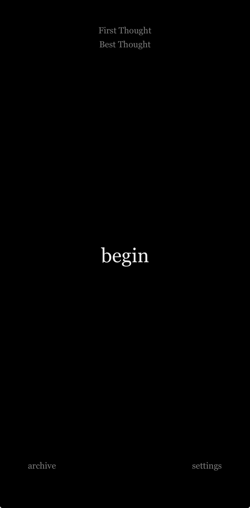
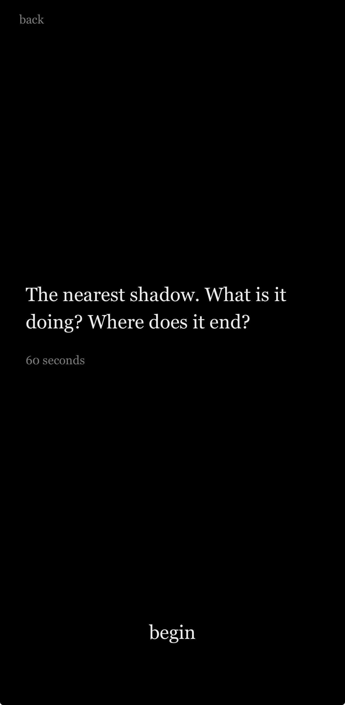
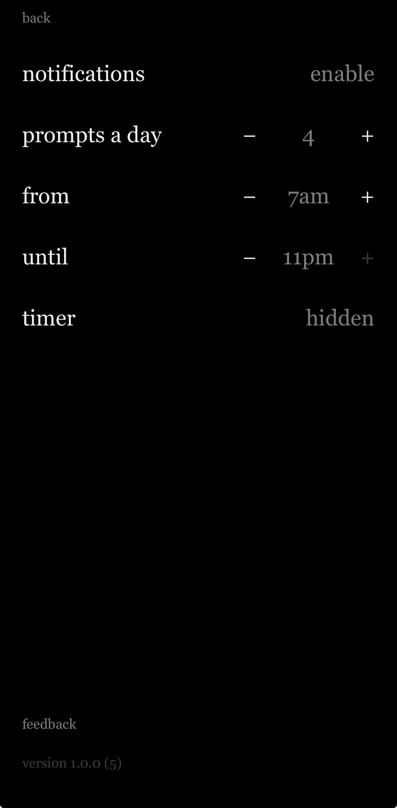

# First Thought Best Thought

**A practice tool for spontaneous writing. No backspace. No revisions.**

---

## The idea

> "You're a Genius all the time." — Jack Kerouac

First Thought Best Thought interrupts you at unpredictable moments with a brief
creative prompt. When the timer ends, the piece is finished — you can keep it, share it, or discard it, but you cannot edit it.

The premise is not that creativity must be learned, but that it must be *released* —
that the ordinary mind, caught in the act of noticing, is already doing something
extraordinary. The app creates the conditions (speed, constraint, surprise, permission) for Genius and trusts what emerges.

## What it is not

- **Not a journal** — no editing, folders, tags, or titles.
- **Not a productivity app** — no goals, streaks, or metrics.
- **Not a social network** — no accounts and no feed; everything stays on your device.
- **Not a writing coach** — it never scores, critiques, or "improves" what you wrote.

## Screenshots

  
  &nbsp;&nbsp;
  
  &nbsp;&nbsp;
  

## The eight traditions

Every prompt carries a lineage (kept invisible in the app). Rotation is fixed, on the
Oblique Strategies model — you never curate it:

**Beat** sketching · **Fluxus** instruction pieces · **Oulipo** constraints ·
**Dada** chance operations · **Surrealist** inquiry · **Oblique** reframings ·
**Memory & Dream** · **Boal** de-mechanization

## How it's built

- **React Native + Expo** (TypeScript), iOS-first.
- **Local-first:** everything lives on-device (SQLite). No backend, no accounts, no
  network calls for any core function. No analytics.
- **The interruption model:** local scheduled notifications deliver prompts at
  unpredictable, unguessable times within a waking window — never a tidy schedule.
- **The no-backspace mechanism** is enforced by an *append-only invariant*: a text
  change is accepted only if it is a pure forward extension of what's already written.
  Validating the *result* rather than the keystroke makes it resistant to backspace,
  select-all-delete, cut, paste-over, and autocorrect alike — regardless of how the
  edit was attempted.

## Status

Submitted to the App Store — v1.0.0. Link coming when it's live.

## Privacy

The app collects nothing and sends nothing off your device.
[Privacy policy](https://thehanslevi.github.io/ftbt-legal/privacy.html).

---

Created by Daniel Pinchbeck & collaborators at The Creationship · East Village, NYC

